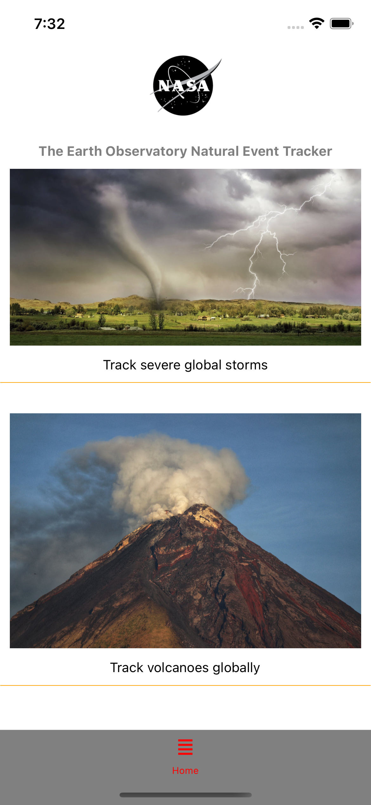
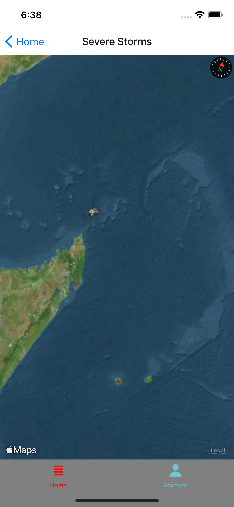
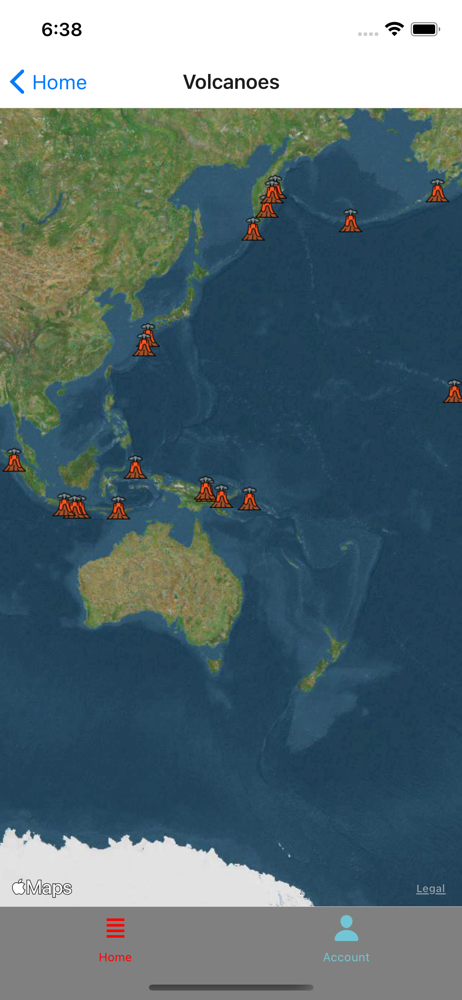
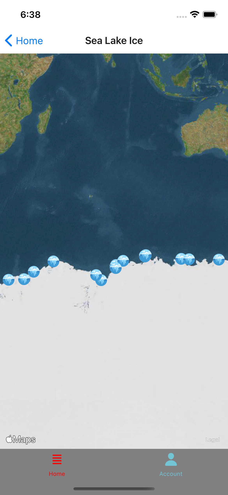
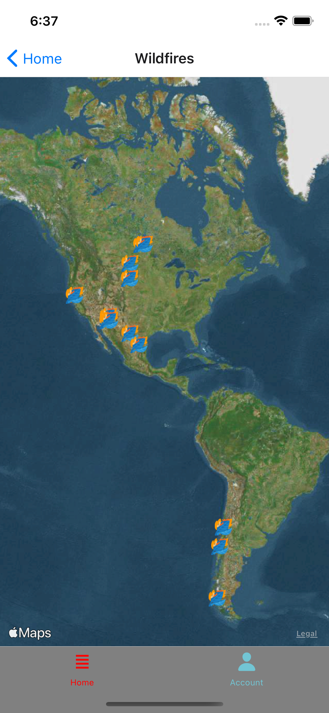

# NASA API's : The Earth Observatory Natural Event Tracker (EONET) GRAPHQL







Application built with react native frontent and grpahql backend.

The app diplays on a map:

• volcanoes
• wildfires
• seaLakeIce
• severeStorms

##### Setup server

```
cd server
npm install
```

##### Compiles and runs at http://localhost:4000/

```
npm start
```

##### React native

```
npm install

npx react-native start
```

## NASA API's : The Earth Observatory Natural Event Tracker (EONET)

https://api.nasa.gov/

The Earth Observatory Natural Event Tracker (EONET) is a prototype web service with the goal of:

providing a curated source of continuously updated natural event metadata; providing a service that links those natural events to thematically-related web service-enabled image sources (e.g., via WMS, WMTS, etc.). Please see our API documentation to learn more about how to use the EONET web services.

Development of EONET began in 2015 and has been supported by NASA’s Earth Observatory and Earth Science Data and Information System (ESDIS) Project.
